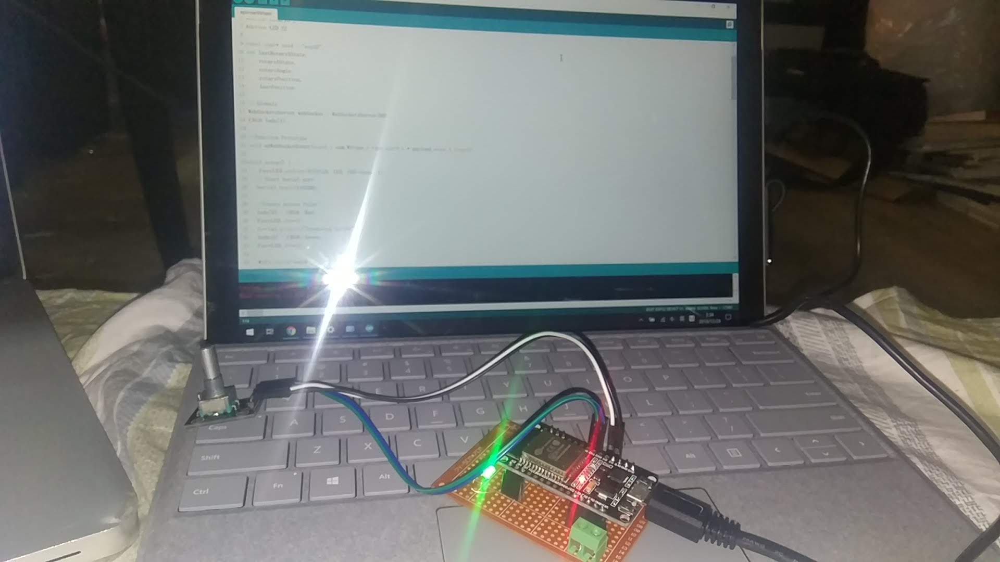
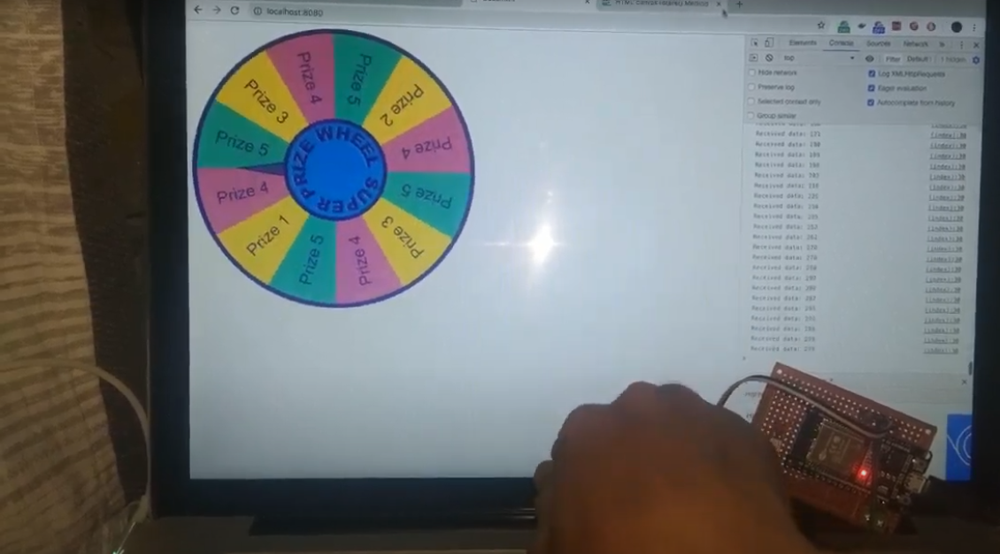
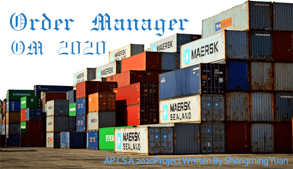
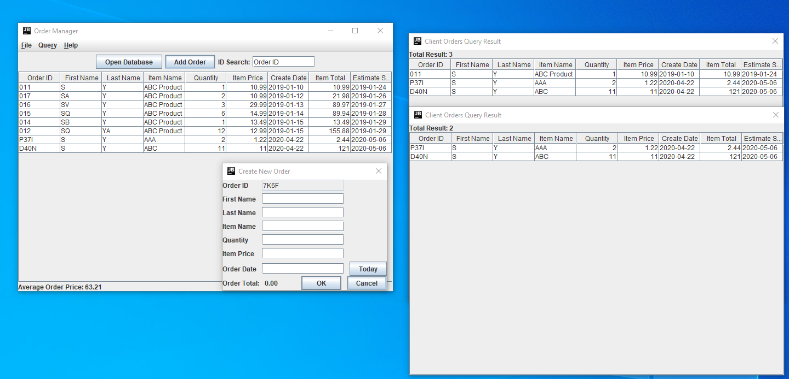
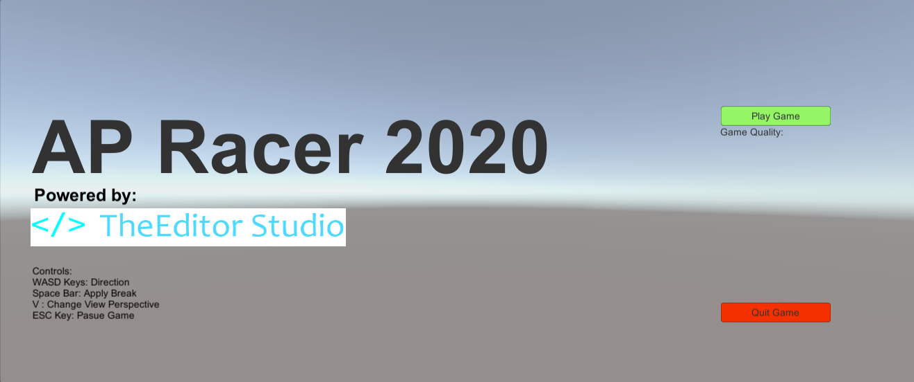
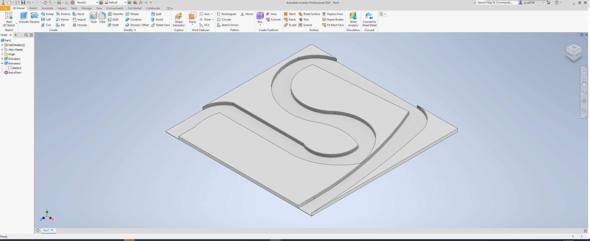
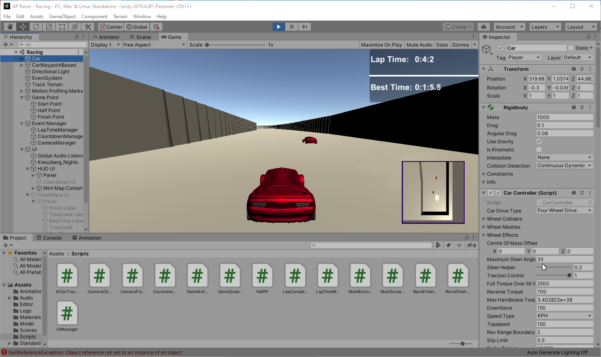

# My FLHS Computer Science's Project Collection

## Table of Content

* [Introduction](#introduction)
* [Second Year(C++)](#second-yearc)
  * [Wheel of Fortune (Dec 2018)](#wheel-of-fortune-dec-2018)
  * [Console BattleShip (Feb 2019)](#console-battleship-feb-2019)
  * [Lyrics(Karaoke) Presenter (Feb 2019)](#lyricskaraoke-presenter-feb-2019)
  * [Blackjack (April 2019)](#blackjack-april-2019)
  * [Poker Identification System (May 2019)](#poker-identification-system-may-2019)
  * [ConsoleRPG (May 2019, Final Project)](#consolerpg-may-2019-final-project)
* [Third Year(Java/AP CS A)](#third-yearjavaap-cs-a)
  * [Project Euler Oral Presentation Q29(Sep 2019)](#project-euler-oral-presentation-q29sep-2019)
  * [Project Euler Oral Presentation Q24(Feb 2020)](#project-euler-oral-presentation-q24feb-2020)
  * [Order Managment System(April 2020)](#order-managment-systemapril-2020)
  * [Car Racing Game(AP Racer, Final Project)(June 2020)](#car-racing-gameap-racer-final-projectjune-2020)
* [The End](#the-end)

## Introduction

Hi! My name is Shengming Yuan, FLHS Class of 2020. This is the a collection of my software project that I was ~~forced to be~~ done in my computer science class. I also included some of the difficulty and road block I hit.  

## Second Year(C++)

### Wheel of Fortune (Dec 2018)

Code name: WOF

#### The Project(WOF)

This was my first CS Project in this class. I was planned to build a real wheel.

[Demo Video](https://photos.app.goo.gl/scnfjsiPpsY9REbL9)

It was quite fun doing this the hardware way, the only issue that I have encounterd is not the software, it's actually find a good disk to work with it.

Here is a pictrue I took while is in development.

#### The Code(WOF)

No source code available, I think I already deleted it :(.

### Console BattleShip (Feb 2019)

Code name: CB

#### The Project(CB)

This is where I really started to pick up OOP in C++. The entire pointer thing is kinda hard to understand but I did get use to it.

#### The Code(CB)

[Source Code](https://github.com/ssysm/battleship)

### Lyrics(Karaoke) Presenter (Feb 2019)

Code name: LP

#### The Project(LP)

I actually have this lyrics.js libaray written from a year ago and didn't finish because I was at that time not really understand how regex works. But as time went on I did manage to learn more and eventually fixed the software for this class.

Also note this isn't a real project, is just we have too much free time and decided to do this.

#### The Code(LP)

[Demo Site](https://static.theeditorstudio.com/lyrics.js/demo)

### Blackjack (April 2019)

Code name: BJK

#### The Project(BJK)

Surprisingly, I didn't have any problem with writing the code, is in fact I don't play card and don't understand how blackjack works.
At the end the program works just fine, and I did learned a thing and two from this.

#### The Code(BJK)

[Source Code](https://github.com/ssysm/blackjack)

### Poker Identification System (May 2019)

Code name: PIS

#### The Project(PIS)

This is the first CS project that was done in JavaScript in this class and I was finally to show my web dev's abilty. Also note that this is a group project but I don't have any group member so is just me :(

The end result turn out to be great. I even liked it(lol).

And there's a moral to this project: **_DO NOT GAMBEL_**

#### The Code(PIS)

[Demo Site](https://static.theeditorstudio.com/pokerID-js/)

[Source Code](https://github.com/ssysm/pokerID-js)

### ConsoleRPG (May 2019, Final Project)

Code name: CRPG

#### The Project(CRPG)

This is one of the hardest, if not the only project I have real struggle to complete. Since I'm a gamer, game design to me is another dimension. I was not able to learn any game engine in time to hand in the project.

This is the first project I used Visual Studio(and the last).

#### The Code(CRPG)

[Source Code](https://github.com/ssysm/ConsoleRPG)

## Third Year(Java/AP CS A)

### Project Euler Oral Presentation Q29(Sep 2019)

Code name: Q29

#### The Project(Q29)

The question:
> How many distinct terms are in the sequence generated by ab for 2 ≤ a ≤ 100 and 2 ≤ b ≤ 100?

It's very easy, I used `HashMap` for my final result to get better performance. At the end of the day, this is a entry level question on Projecy Euler.

#### The Code(Q29)

[C++ Source](https://gist.github.com/ssysm/ebcc0c4eeb5a31c84e67addc39d6e318)

[Java Source](https://gist.github.com/ssysm/ed699c397c4a4b3f293a7395cc4edc16)

### Project Euler Oral Presentation Q24(Feb 2020)

Code name: Q24

#### The Project(Q24)

The problem:
> How do we find the lexicographic permutations of ‘01234567890’ at the 1 millionth place?

This is the first paired oral presentation I have ever done. The problem seems very hard at first but after few hours of fancy math we were able to come up with a solution that doesn't even require to program it.

#### The Code(Q24)

[Technical Paper](assets/q24/PE24_paper.pdf)

### Order Managment System(April 2020)

Code name: OMS

#### The Project(OMS)

This is first time I ever wrote GUI in Java(Swing). I *really* do not like the way swing handle styling. I have to use IDEA's built-in form editor to design a "not bad looking" form. But considering Javafx is can't be run on a stock JDK system, I have to go with swing.

The swing framework does come with some cool feature built in. Detectable window panel was really nice. Auto sort table also saved my day.

I learned a lot of how `static` class and method works. That really helped me on my personal project.

But never the less it was a great project.

#### The Code(OMS)

[Source Code](https://github.com/ssysm/OrderManager)

### Car Racing Game(AP Racer, Final Project)(June 2020)

Code name: APR

#### The Project(APR)

For this project we were assigned to use Processing, but our AP test is already finished so I guess it's time to pick up a new skill that I haven't had a chance to do before - Game Dev.

I was planning to use JMonkeyEngine but the IDE is really hard to use... So I switched to use Unity with C#.

The initial experience with unity was not good, I have zero idea what I'm looking at, but by following some guide from offical unity forum I quickly got the hang of it.

Another interesting while I was doing the stage design is I designed the race rack in Autodesk Inventor.

I actually learned a lot of unity and game design in general.

Also I think I really abuse the use of `GameObject`.

#### The Code(APR)

[Source Code](https://github.com/ssysm/APRacer)

## The End

I actually learned a lot of stuff from making all those side projects, it's really cool!

EOF
